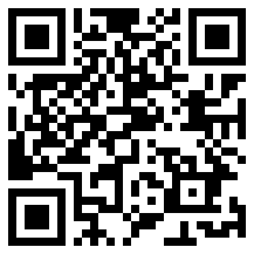

# 月汐 MoonTide

> 抽一张牌，看见空间的潮汐。

月汐是一个把塔罗叙事与可执行空间建议结合起来的黑客松项目。用户扫码进入手机网页、观察当前环境、洗牌并转动牌轮选牌，获得 78 张牌正逆位解读和三条可以马上执行的建议。

## 现场扫码

公开体验地址：[https://liab-bb.github.io/MoonTide/](https://liab-bb.github.io/MoonTide/)

## 今日验收标准

- 能跑：核心流程稳定完成，并有示例数据兜底。
- 有用：每次结果至少包含三条可执行建议。
- 有意思：抽牌、空间可视化和分享卡片构成完整体验。

## MVP 流程

1. 选择单张 Yes / No 或三张“空间潮汐”牌阵。
2. 启动前置摄像头或选择照片，在浏览器本地识别常见物体并测量画面亮度；用户最终确认意图、场景、光感与整洁度。
3. 通过浏览器加密随机源洗牌，拖动带惯性的牌环并凭直觉抽取牌面；每张会立刻显示简短提示。
4. 查看 78 张牌正逆位的空间解读、旧金山潮位，以及由可验证视觉线索与牌面共同生成的行动建议。
5. 在页面内预览结果分享卡片，再由用户选择保存；照片默认不进入分享图。

## 开发原则

- 优先保证一个完整、稳定、可演示的流程。
- 摄像头画面与照片只在用户浏览器中使用，不上传、不保存；常见物体由浏览器内的 COCO-SSD 模型识别，塔罗解读由本地规则生成。
- 旧金山潮位仅从 NOAA CO-OPS 公开预测接口读取，不会发送照片或个人资料；接口不可用时自动降级为无潮位提示。
- 不实现账号、支付、数据库、云端图片上传或模型训练。TensorFlow.js 与 COCO-SSD 从固定版本 CDN 加载，首次使用视觉识别需要网络。
- 产品只用于娱乐和空间灵感，不提供健康、财务或命运方面的确定性判断。

## 本地运行

摄像头 API 需要安全上下文。线上请使用 HTTPS；本机预览请通过 `localhost` 启动静态服务器，不要直接双击 `index.html` 后期待摄像头可用。

## 团队分工

- 技术：页面、规则引擎、可视化、部署
- 产品：范围、流程、验收清单
- 内容：牌义与空间建议
- 视觉：牌面、示例房间、结果卡片
- 路演与测试：反馈、讲稿、现场演示

## 项目文档

协作文档存放在团队 Google Drive 文件夹中；网页以 GitHub Pages 公开 HTTPS 部署，二维码指向该链接。
